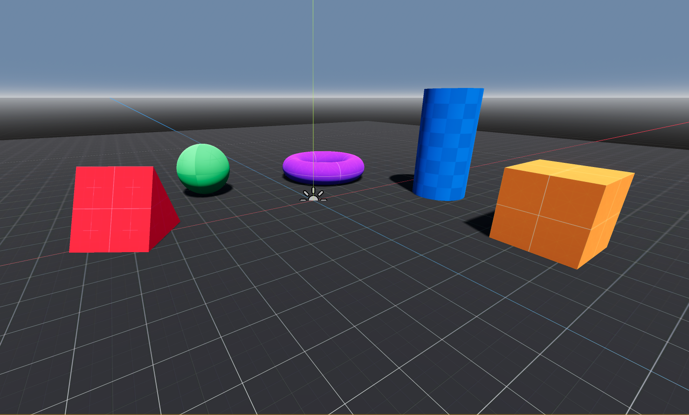

# Prototype Mini Bundle

I find myself downloading [Kenney prototype textures](https://www.kenney.nl/assets/prototype-textures) over and over again with each demo project I create. And when I do, I create the same set of materials and prototype shapes to scatter around my scene. So here they are in a neat package, one click away.

> Psst: The blue prototype texture is exclusive! :)

## Credit

- The one and only [Kenney](https://www.kenney.nl) - thanks!
